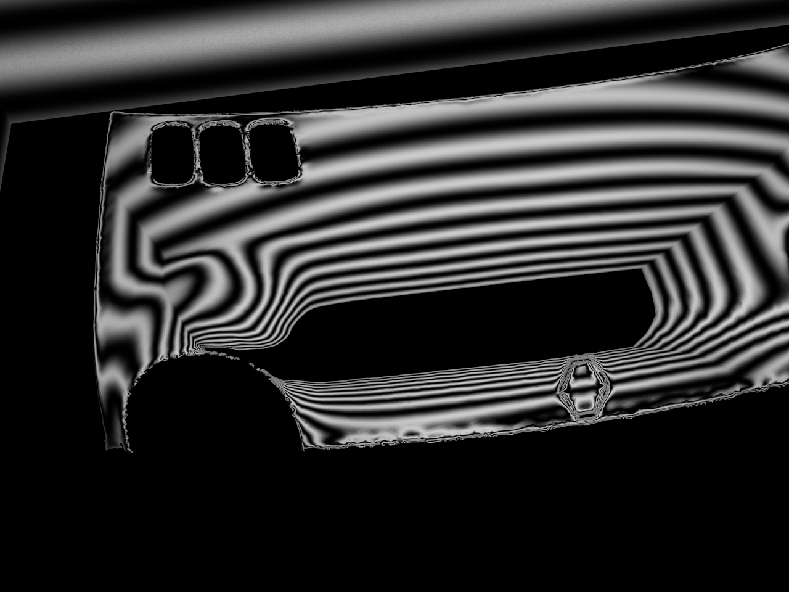
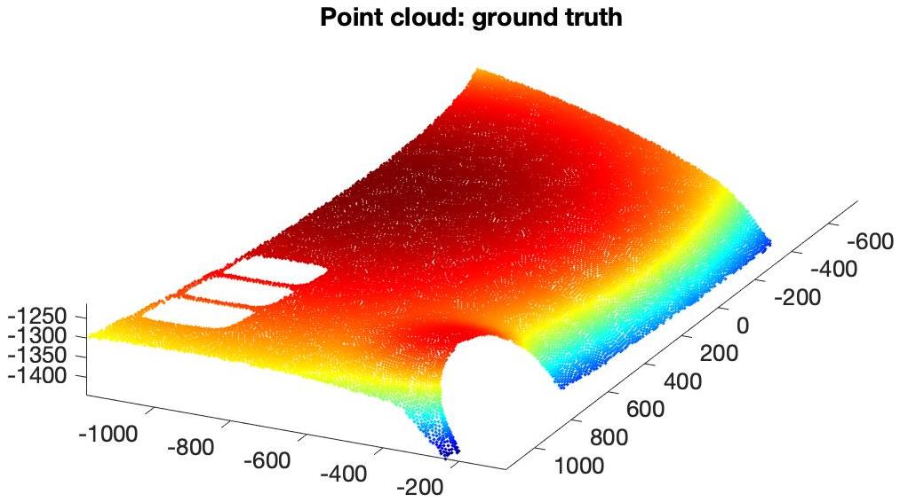
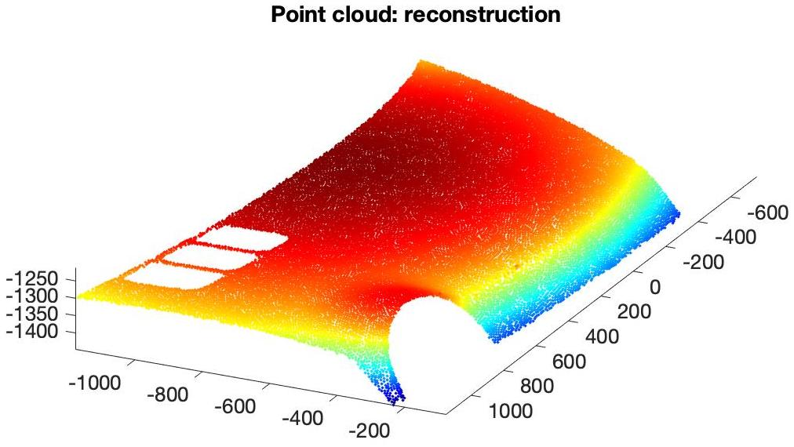
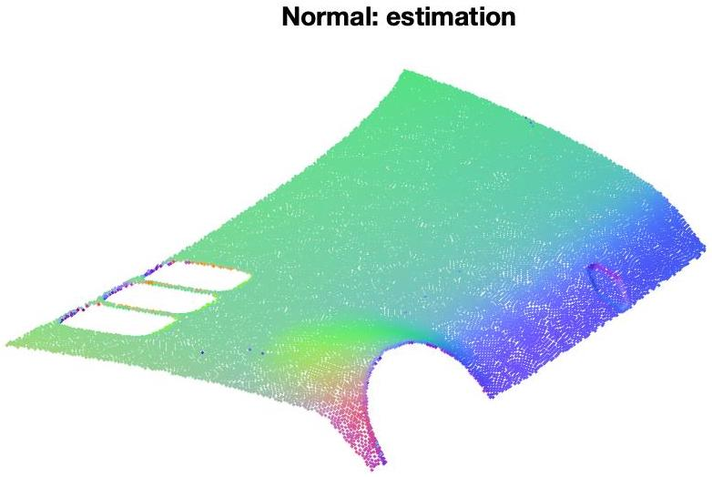
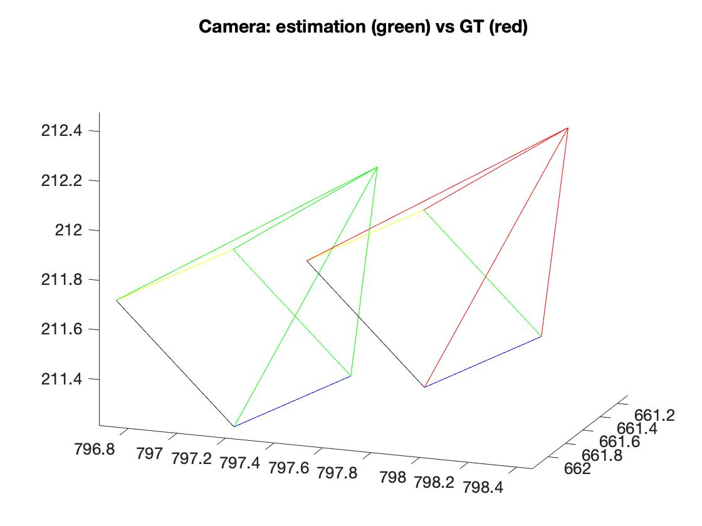

# Mirror Surface Reconstruction

This repository contains the Matlab code for the algorithm introduced in our CVPR'16 and TIP'21 papers on mirror surface reconstruction [[Project papge](http://k-han.github.io/mirror)]. 

## Requirements
- Matlab R2020a
- Add-Ons: Optimization Toolbox, Signal Processing Toolbox 

## Data
Our algorithm takes the reflection correspondences as the input to reconstruct the mirror surface. In this demo code, we reconstruct the hood shape (in `./data/`) rendered by [Balzer et al](https://doi.org/10.1109/3DV.2014.85). 
<p align="center">
    

</p>

## Usage

The reconstruction can be done by simply running the entry code

```main.m```


## Results
<br>
<p align="center">
    
    
</p>

<p align="center">
    
    
    
</p>

## BibTex
If you use this code for your research, please cite our paper

```bibtex
@article{han21fixed,
 title   = {Fixed Viewpoint Mirror Surface Reconstruction under an Uncalibrated Camera},
 author  = {Kai Han and Miaomiao Liu and Dirk Schnieders and Kwan-Yee K. Wong},
 journal = {IEEE Transactions on Image Processing (TIP)},
 year    = {2021}
}

@inproceedings{han16mirror,
 title     = {Mirror Surface Reconstruction under an Uncalibrated Camera},
 author    = {Kai Han and Kwan-Yee K. Wong and Dirk Schnieders and Miaomiao Liu},
 booktitle = {IEEE Conference on Computer Vision and Pattern Recognition (CVPR)},
 year      = {2016}
}
```

If you use the hood data for your research, please cite

```bibtex
@inproceedings{balzer14cavlectometry,
 title     = {Cavlectometry: Towards Holistic Reconstruction of Large Mirror Objects},
 author    = {Jonathan Balzer and Daniel Acevedo-Feliz and Stefano Soatto and Sebastian Höfer and Markus Hadwiger and Jürgen Beyerer},
 booktitle = {International Conference on 3D Vision (3DV)},
 year      = {2014}
}
```